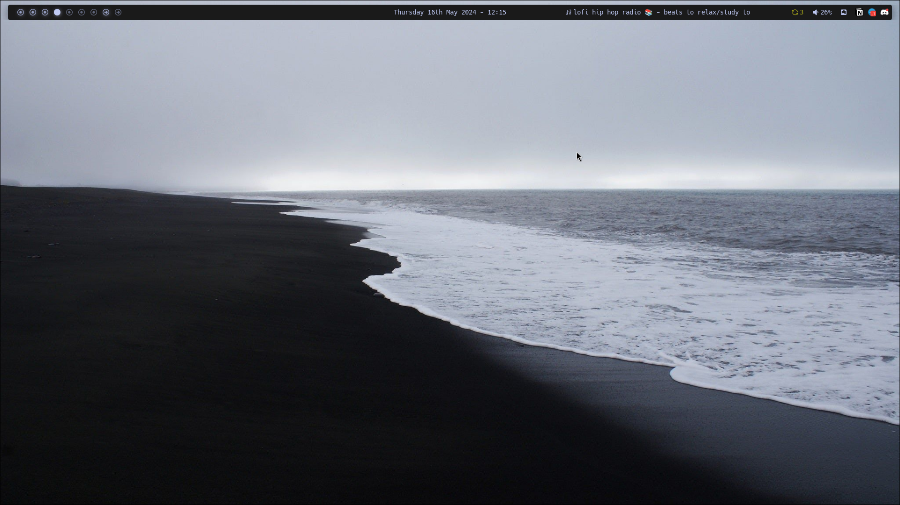
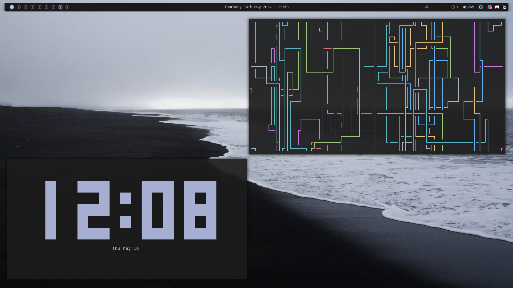
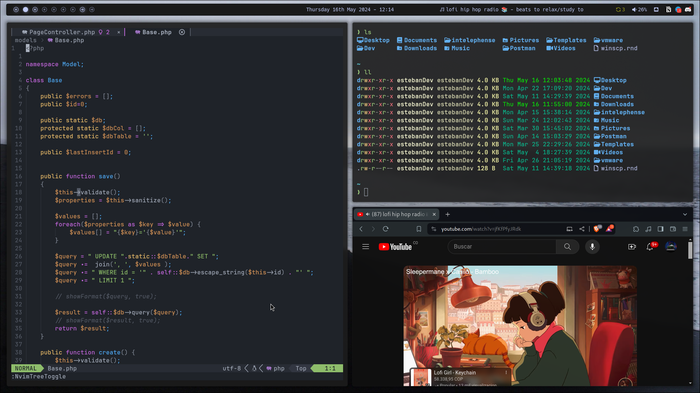
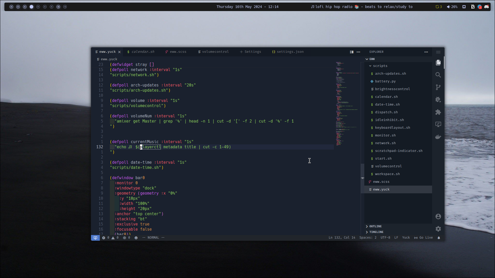
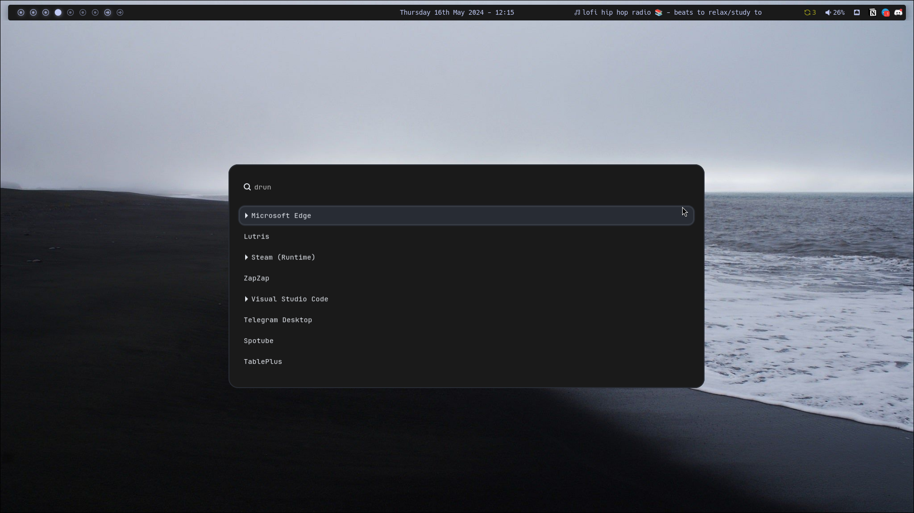

# Hyprland FreshDesktop

- Term `kitty`
- WM `Hyprland`
- Browser `Brave`
- StatusBar `eww`
- Distro `ArchLinux`
- Notifications `dunst`
- File Manager `joshuto`

There are hidden files, remember to look at them!

*I've reused other people's code, I don't remember the authors of each base.*